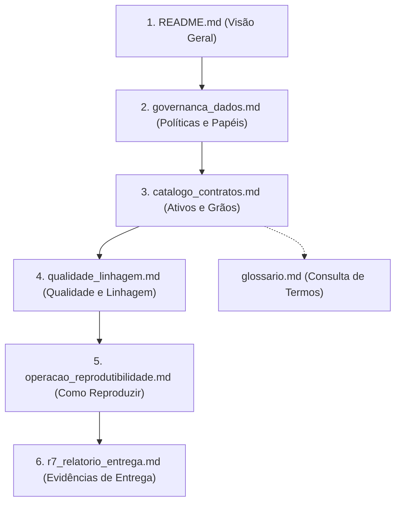

# Governança, Catálogo, Linhagem e Reprodutibilidade do Lakehouse

## 1. Objetivo e Contexto

Este pacote documental consolida formalmente o arcabouço de governança de dados, catálogo técnico, matriz de qualidade, linhagem ponta a ponta e guias de reprodutibilidade operacional do **Lakehouse de Transferências Discricionárias e Legais da União**.

O objetivo primordial é explicitar e documentar de forma estruturada, verificável e acadêmica as garantias de proveniência, integridade, conformidade semântica e rastreabilidade que foram implementadas ao longo dos ciclos de engenharia do projeto (R1 a R6).

> [!NOTE]
> O ciclo **R7** não cria novas camadas de dados, não adiciona novas fontes, não cria novas DAGs operacionais nem altera a lógica de transformação de negócio. Sua atuação é transformar os mecanismos técnicos distribuídos já existentes em governança explícita e auditável.

---

## 2. Estrutura Documental

A documentação de governança está organizada nos seguintes módulos temáticos:

| Documento | Foco Principal | Descrição Sintética |
| :--- | :--- | :--- |
| [governanca_dados.md](governanca_dados.md) | Políticas e Diretrizes | Princípios de governança, papéis e responsabilidades, classificação dos dados, política por camadas, ciclo de vida, retenção, segurança e limitações. |
| [catalogo_contratos.md](catalogo_contratos.md) | Ativos e Contratos | Catálogo consolidado de ativos (Bronze, Staging, Silver, Gold, Semantic, Serving), contratos de grão, chaves e regras de aditividade financeira. |
| [qualidade_linhagem.md](qualidade_linhagem.md) | Qualidade e Rastreabilidade | Matriz multidimensional de qualidade de dados, mecanismos de controle, linhagem lógica de dados e linhagem operacional de execução. |
| [glossario.md](glossario.md) | Terminologia do Negócio | Glossário enxuto de conceitos de negócio, técnicos, dimensionais e de engenharia de dados adotados no Lakehouse. |
| [operacao_reprodutibilidade.md](operacao_reprodutibilidade.md) | Operação e Execução | Guia passo a passo para inicialização da stack Docker, execução E2E, validação de checkpoints, geração do dbt Docs e manutenção preventiva. |
| [r7_relatorio_entrega.md](r7_relatorio_entrega.md) | Relatório de Fechamento R7 | Evidências quantitativas de catálogo, conformidade dos contratos, inventário do manifesto dbt e validação formal da entrega do R7. |

---

## 3. Como Navegar

Para uma compreensão completa da arquitetura de governança, recomenda-se a seguinte trilha de leitura:

---

## 4. Integração com as Ferramentas do Lakehouse

A governança do projeto é suportada ativamente pela infraestrutura tecnológica e orquestração:

### 4.1 dbt Docs (Catálogo e Linhagem Interativa)
- O catálogo técnico de colunas, tipos de dados, testes automatizados e grafo de dependência DAG interativo é compilado via `dbt docs generate`.
- Os metadados documentados em YAML (`sources_bronze.yml`, `staging/schema.yml`, `silver/schema.yml`, `gold/schema.yml`, `semantic/schema.yml`, `serving/schema.yml`) alimentam diretamente o servidor do dbt Docs na porta local `8091`.
- Consulte [operacao_reprodutibilidade.md](operacao_reprodutibilidade.md#5-catalogo-interativo-dbt-docs) para instruções de inicialização.

### 4.2 Apache Airflow (Orquestração e Linhagem Operacional)
- A orquestração das DAGs (`dag_lakehouse_e2e`, `dag_lakehouse_ingestion`, `dag_lakehouse_transformation`) provê a linhagem operacional de ponta a ponta.
- Os identificadores de execução (`ingestion_run_id`) conectam os snapshots brutos ingeridos em `bronze.ingestion_runs` e `bronze.ingestion_manifest` a todas as tabelas Silver, Gold e Serving downstream.

### 4.3 Relação com os Relatórios Técnicos R2–R6
Os relatórios anteriores contêm as evidências históricas e descobertas empíricas de cada ciclo:
- [Relatório R2](../r2_relatorio_validacao.md): Ingestão bruta, extração ZIP oficial, hashing SHA-256 e criação da camada Bronze.
- [Relatórios R3](../r3/): Auditoria da base Siconv, detecção de cardinalidade Programa × Proposta N:N, superchave de elegibilidade e conflitos de observação de convênio.
- [Relatórios R4](../r4/): Modelagem dimensional Gold Core, criação da dimensão de calendário `dim_data` com sentinelas e separação entre `fct_convenio` canônica e `fct_convenio_saldo_observacao`.
- [Relatórios R5](../r5/): Criação da view semântica e da serving mart `mart_superset_proposta_convenio` com equivalência analítica estrita e dashboards no Apache Superset.
- [Relatórios R6](../r6/): Orquestração E2E integrada, detecção de alteração de fonte (`data_carga_siconv` / `NO_CHANGE`) e isolamento estrito de testes dbt por camada.

Os documentos presentes neste diretório consolidam as regras estruturais derivadas dessas etapas em um modelo perene de governança que permanece válido mesmo após futuras atualizações dos dados da fonte.
