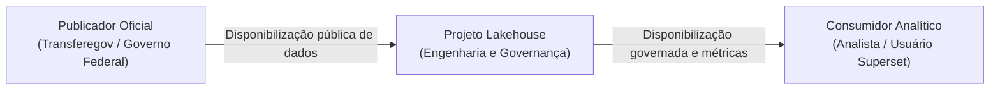
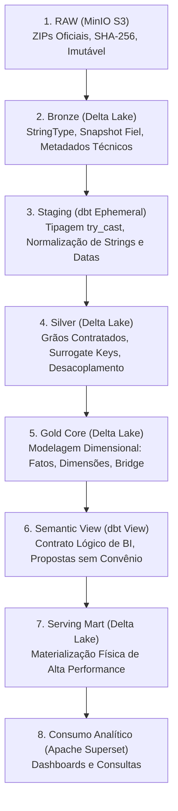
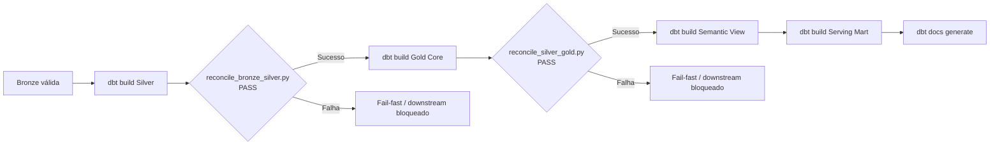

# Política de Governança de Dados

## 1. Objetivo e Escopo

Este documento estabelece as diretrizes formais de governança para o **Lakehouse de Transferências Discricionárias e Legais da União**. O escopo abrange todas as fases do ciclo de vida do dado dentro da plataforma — desde a captura dos arquivos abertos oficiais do Transferegov até o consumo analítico no Apache Superset —, definindo princípios, classificações, políticas operacionais por camada, garantias de qualidade e salvaguardas de conformidade.

---

## 2. Princípios Fundamentais

A governança do Lakehouse é orientada por seis princípios essenciais:

1. **Fidelidade à Fonte Oficial**: A camada de entrada preserva integralmente as características e anomalias dos dados originais disponibilizados pelo publicador, sem deduplicações ou tratamentos arbitrários.
2. **Imutabilidade e Reprodutibilidade**: Os artefatos originais brutos e os metadados de ingestão são armazenados de forma imutável, permitindo reconstruir e auditar deterministicamente qualquer tabela em qualquer momento.
3. **Segregação Estrita de Responsabilidades**: As camadas arquiteturais possuem papéis analíticos distintos e isolados (RAW, Bronze, Staging, Silver, Gold, Semantic e Serving).
4. **Contratos Semânticos e de Aditividade**: A cardinalidade entre entidades (ex: Programa × Proposta N:N) e a natureza das medidas contábeis (aditivas vs. observacionais) são protegidas por modelo e testes contínuos.
5. **Fail-Fast Operacional**: Nenhuma transformação avança para a camada seguinte sem que os gates de auditoria e testes de integridade sejam aprovados com sucesso.
6. **Minimização e Responsabilidade com Identificadores**: Embora o dataset seja de natureza pública oficial, a exposição de identificadores de pessoas físicas requer tratamento consciente e governado.

---

## 3. Papéis e Responsabilidades

Para fins acadêmicos e operacionais da arquitetura, os papéis no ciclo do dado são definidos de forma enxuta e funcional:

- **Fonte / Publicador Oficial (Transferegov / Ministério da Gestão e da Inovação / Governo Federal)**:
  - Sistema de registro oficial dos atos administrativos de transferências voluntárias da União.
  - Responsável pela custódia primária, geração periódica e disponibilização dos arquivos abertos (.csv compactados em .zip).
  - *Nota*: O projeto Lakehouse não é proprietário nem gestor da base de dados oficial.
- **Projeto Lakehouse (Engenharia e Governança)**:
  - Responsável técnico pela captura, auditoria criptográfica, extração, carga em tabelas Delta Lake, transformação dimensional, catálogo, aplicação de testes de conformidade e exposição analítica.
  - Assegura que o dado transformado respeite os grãos contratados e ofereça rastreabilidade completa.
- **Consumidor Analítico (Usuário do Dashboard / Analista de Dados)**:
  - Usuário que consome os dados por meio do Apache Superset ou consultas SQL via Spark Thrift Server.
  - Responsável por interpretar as métricas e relatórios estritamente dentro dos contratos de negócio estabelecidos (ex.: não somar valores de convênios agrupando por programa governamental).

---

## 4. Classificação dos Dados

Adota-se uma taxonomia objetiva de quatro níveis para categorizar todos os dados mantidos no Lakehouse:

| Classe | Descrição | Exemplos no Projeto | Requisitos de Tratamento |
| :--- | :--- | :--- | :--- |
| **Público Oficial** | Dados administrativos originários de publicações governamentais de acesso irrestrito. | `numero_convenio`, `objeto_proposta`, `valor_global_convenio`, `situacao_convenio`, `nome_programa`. | Livre trânsito na plataforma; conformidade de formato e tipo. |
| **Público com Identificador Pessoal Potencial** | Dados públicos que podem conter identificadores diretos de pessoas físicas (proponentes individuais). | `identificacao_proponente` (CNPJ de pessoa jurídica ou CPF de pessoa física), `nome_proponente`. | Minimização em apresentações acadêmicas; proibição de publicação de listas de CPFs reais em documentações abertas. |
| **Metadado Técnico** | Atributos internos de controle, rastreabilidade, hash criptográfico e versionamento. | `__ingested_at_utc`, `__ingestion_run_id`, `__source_file`, `__source_sha256`, `delta_version`. | Preservação conforme o contrato do ativo: metadados por linha em Bronze/Silver e na fato observacional; metadados de execução/modelo para Gold canônica, Semantic e Serving. |
| **Dado Derivado Analítico** | Métricas calculadas, flags de negócio, conformações dimensionais e materializações analíticas. | `data_sk`, `is_instrumento_ativo`, `tem_convenio`, `quantidade_propostas`, `mart_superset_proposta_convenio`. | Sujeição a testes de consistência, testes de regressão e validação semântica. |

### 4.1 Governança de Identificadores Pessoais
No Transferegov, propostas de transferências podem ser cadastradas tanto por entes federativos e entidades jurídicas quanto por proponentes individuais (produtores rurais, pessoas físicas em editais específicos).
- O campo `identificacao_proponente` armazena números de CNPJ ou CPF sem distinção explícita de máscara no arquivo bruto.
- **Salvaguardas adotadas**:
  1. A disponibilidade pública pelo Governo Federal não isenta a governança do Lakehouse de zelo no manuseio.
  2. A documentação técnica, testes automatizados e relatórios de entrega **não reproduzem CPFs reais** de proponentes.
  3. Recomenda-se a agregação de indicadores por município, órgão ou modalidade em painéis executivos, evitando a exposição desnecessária de cadastros de pessoa física.
  4. Este documento não constitui parecer jurídico sobre a LGPD (Lei nº 13.709/2018), refletindo apenas boas práticas de minimização de engenharia de dados.

---

## 5. Política por Camada Arquitetural

A arquitetura lógica e tecnológica do Lakehouse organiza o processamento de ponta a ponta em sete estágios rigorosamente governados:

### 5.1 RAW
- **Armazenamento**: prefixo RAW no bucket Bronze (`s3://bronze/raw/transferegov/<dataset>/...`).
- **Natureza**: Arquivo ZIP original baixado diretamente da URL oficial do Transferegov.
- **Governança**: Imutabilidade lógica estrita. Todo arquivo recebe cômputo de hash SHA-256 imediatamente após o download.
- **Retenção**: Política de retenção de 2 versões (`raw_versions_per_dataset = 2`), mantendo o snapshot atual e o imediatamente anterior para permitir comparações físicas e rollbacks operacionais.

### 5.2 Bronze
- **Armazenamento**: tabelas Delta sob `s3a://bronze/warehouse/<dataset>`.
- **Formato**: Tabelas transacionais Delta Lake (`bronze.siconv_*`).
- **Tipagem**: Os campos oficiais são mantidos como `StringType`; a configuração vigente utiliza delimitador `;` e encoding `utf-8-sig`. A tipagem de negócio ocorre somente a partir de Staging.
- **Metadados Obrigatórios**: Toda linha física recebe:
  - `__ingested_at_utc`: Timestamp da captura.
  - `__ingestion_run_id`: identificador determinístico de correlação da execução.
  - `__source_file`: nome do arquivo ZIP oficial associado à carga da linha.
  - `__source_sha256`: Hash do arquivo original garantindo integridade criptográfica.

### 5.3 Staging
- **Materialização**: `ephemeral` (dbt). Não gera tabelas físicas no MinIO, existindo apenas como CTEs / subconsultas durante a compilação e execução da camada Silver.
- **Papel**: Ponto único de tipagem (`try_cast`), conversão de datas brasileiras (`parse_date_br`), tratamento de strings vazias (`clean_string`) e conversão segura de moedas para `DECIMAL(17,2)`. Propaga os metadados técnicos de linhagem para a Silver.

### 5.4 Silver
- **Armazenamento**: tabelas Delta sob `s3a://silver/warehouse/`.
- **Formato**: Delta Lake (`silver.siconv_*`).
- **Estrutura**: Desacoplamento de entidades complexas e resolução de inconsistências de grão:
  - `siconv_proposta`: 1 linha por proposta de trabalho (`id_proposta`).
  - `siconv_programa_cadastral`: 1 linha por programa (`id_programa`).
  - `siconv_programa_elegibilidade`: 1 linha por critério de elegibilidade regional/orçamentária, identificada por surrogate key determinística SHA-256 (`id_programa_elegibilidade`).
  - `siconv_programa_proposta`: Vínculo associativo N:N preservado no grão par (`id_programa`, `id_proposta`).
  - `siconv_convenio`: 1 observação do instrumento no snapshot oficial (`id_convenio_observacao`), preservando observações concorrentes legítimas.

### 5.5 Gold Core
- **Armazenamento**: ativos Gold sob `s3a://gold/warehouse/` quando materializados fisicamente.
- **Formato**: Delta Lake (`gold.dim_*`, `gold.fct_*`, `gold.bridge_*`).
- **Modelagem Dimensional**: Esquema estrela estendido com separação funcional rigorosa:
  - Dimensão de calendário `dim_data` com sentinelas estruturais (-1 Não Informado, -2 Fora da Janela Analítica).
  - Dimensões conformadas: `dim_proponente`, `dim_municipio`, `dim_orgao`, `dim_programa`.
  - Tabela fato de propostas: `fct_proposta` (grão 1 linha por proposta).
  - Tabela fato canônica de convênios: `fct_convenio` (grão 1 linha por `numero_convenio`, relação 1:1 estrita partindo de convênio para proposta).
  - Tabela fato observacional de saldos: `fct_convenio_saldo_observacao` (grão 1 observação física, isolando divergências de `valor_saldo_conta`).
  - Tabela ponte: `bridge_programa_proposta` (vínculo N:N entre programas e propostas).

### 5.6 Semantic
- **Materialização**: `view` dbt (`gold.vw_superset_proposta_convenio`).
- **Papel**: Contrato lógico formal para consumo analítico. Consolida as propostas e instrumentos através de LEFT JOIN, garantindo que propostas não conveniadas sejam preservadas e estabelecendo regras estritas de não multiplicação de grão. Exclui deliberadamente programas (para evitar contagem duplicada N:N) e `valor_saldo_conta` (por ser medida observacional não aditiva).

### 5.7 Serving
- **Materialização**: `table` Delta Lake (`gold.mart_superset_proposta_convenio`).
- **Papel**: Materialização física da view semântica para alta performance de resposta no Apache Superset, isolando consultas do usuário de joins analíticos custosos em tempo de execução.

---

## 6. Atualização e Freshness dos Dados

- **Política de Freshness**: O pipeline é **source-driven** (orientado à atualização da fonte oficial).
- **Sem Agendamento Automático (Cron)**: O deployment atual opera estritamente sob demanda (`schedule=None` no Apache Airflow). Não existe agendamento noturno ou horário fixo pré-determinado no escopo acadêmico.
- **Detecção de Mudança**: A cada disparo manual da DAG E2E (`r6_pipeline_transferegov_e2e`), o pipeline inspeciona os cabeçalhos e a data de modificação da fonte (`data_carga_siconv`).
  - Se a fonte não tiver sido atualizada desde a última ingestão bem-sucedida, o pipeline sinaliza `NO_CHANGE` e encerra com segurança, economizando recursos computacionais e preservando o estado íntegro do Lakehouse.
  - Se houver novo lote, o pipeline executa o ciclo de ingestão e atualização completa das tabelas Delta.

---

## 7. Ciclo de Vida e Política de Promoção de Dados

A promoção ocorre na ordem real implementada pela DAG `r6_transformacoes_lakehouse`:

Os reconciliadores executam **depois** da materialização da camada que validam. Uma falha bloqueia as etapas downstream; o pipeline não implementa rollback transacional entre camadas, portanto objetos já materializados antes da falha não são revertidos automaticamente.

---

## 8. Retenção e Descarte de Dados

- **Camada RAW**: Política ativa de retenção de 2 versões (`raw_versions_per_dataset = 2`). Ao término de uma ingestão bem-sucedida, versões anteriores além das 2 mais recentes são descartadas do bucket MinIO.
- **Camadas Silver, Gold e Serving**: São camadas derivadas, estruturadas e deterministicamente reconstruíveis a partir da camada Bronze íntegra.
- **Políticas de VACUUM e TTL**: Não foram definidas nem automatizadas políticas de expurgo de histórico transacional (`VACUUM`) ou expiração com base em tempo de retenção (TTL) para as tabelas Delta no escopo acadêmico atual.

---

## 9. Rastreabilidade e Auditoria Técnica

O Lakehouse mantém auditabilidade profunda em dois níveis complementares:

### 9.1 bronze.ingestion_runs (Nível Execução Global)
Registra o estado consolidado de cada execução de ingestão. Entre os campos persistidos estão:
- `ingestion_run_id`: identificador determinístico e seguro da execução.
- `start_time_utc` / `end_time_utc`: janela temporal da execução.
- `status`: estado consolidado (`RUNNING`, `SUCCESS`, `NO_CHANGE` ou `FAILED`).
- `force`: indicador de reprocessamento forçado.
- `source_data_carga_raw_initial` / `source_data_carga_raw_final`: valores brutos do controle oficial observados no início e no fim.
- `successful_datasets`, `error_message` e `retention_status`: evidências operacionais da execução.

### 9.2 bronze.ingestion_manifest (Nível Arquivo / Dataset)
Registra a evidência detalhada por dataset e execução. Entre os campos persistidos estão:
- `ingestion_run_id`: vínculo com a execução global.
- `dataset_id`: identificador do dataset.
- `source_url`, `source_zip_file` e `source_member_file`: proveniência física da fonte.
- `source_sha256`: hash SHA-256 do ZIP oficial associado ao dataset.
- `retrieved_at_utc` / `ingested_at_utc`: timestamps técnicos.
- `logical_input_rows` / `delta_output_rows`: contagens de entrada e saída.
- `raw_s3_key`: chave do objeto RAW no MinIO.
- `delta_table_path` / `delta_version`: localização e versão Delta produzida.
- `status`, `reuse_reason`, `original_run_id` e `retention_status`: estado e histórico de reaproveitamento/retenção.

---

## 10. Segurança, Acesso e Proteção de Segredos

- **Ambiente Operacional**: A plataforma foi concebida para ambiente de laboratório e execução local com **Docker Compose**. Não se destina diretamente a produção corporativa aberta à internet.
- **Controle de Acesso**: No estágio atual, não há autenticação multi-tenant ou controle granular de perfis (RBAC/ABAC) implementado no Lakehouse (Hive Metastore e MinIO compartilham contexto local).
- **Tratamento de Credenciais**: As senhas e chaves configuradas no ambiente `docker-compose.yml` e arquivos de ambiente são exclusivas de desenvolvimento local e **devem ser externalizadas e rotacionadas** (por meio de cofres de segredos corporativos como HashiCorp Vault, AWS Secrets Manager ou Azure Key Vault) antes de qualquer eventual implantação produtiva.
- **Proteção de Documentos**: É vedada a documentação explícita de literais de senhas e segredos em manuais e especificações de governança.

---

## 11. Gestão de Mudanças

Qualquer evolução estrutural ou de modelagem no Lakehouse obedece às seguintes etapas de governança:
1. **Branching e Pull Request**: Alterações são implementadas em branches temáticas com rastreabilidade de commits semânticos.
2. **Validação de Schema dbt**: Execução de `dbt parse` e testes de integridade referencial antes da aprovação de qualquer alteração de código.
3. **CI Automatizado**: Suíte de testes leves em GitHub Actions para assegurar integridade sintática e conformidade dos contratos de dados.
4. **Proteção Histórica**: Documentações de entregas anteriores (`docs/r*/`) são tratadas como evidências datadas e não sofrem reescrita retroativa.

---

## 12. Limitações Estruturais Conhecidas

A governança explicita com transparência as seguintes limitações inerentes ao projeto:

1. **Cardinalidade N:N entre Programas e Propostas**: Um programa pode estar vinculado a múltiplas propostas, e uma proposta pode relacionar-se a múltiplos programas. **Não existe aditividade monetária por programa**.
2. **Medida Observacional de Saldo de Conta**: A coluna `valor_saldo_conta` em convênios apresenta divergências de recência na fonte pública oficial e observações concorrentes. Trata-se de métrica estritamente observacional e não aditiva, excluída do Serving Mart.
3. **Dependência Externa de Freshness**: A frequência de atualização dos dados depende exclusivamente da disponibilização de novos dumps públicos pelo Governo Federal.
4. **Deployment Local e Sem Hardening Produtivo**: O ambiente Docker atual não implementa criptografia em trânsito (TLS/HTTPS) entre os containers internos.
5. **Ausência de Catálogo Corporativo Externo**: Ferramentas enterprise de metadados como DataHub, Apache Atlas ou Microsoft Purview não fazem parte do escopo atual, sendo supridas com excelência técnica pelo dbt Docs e Airflow.
