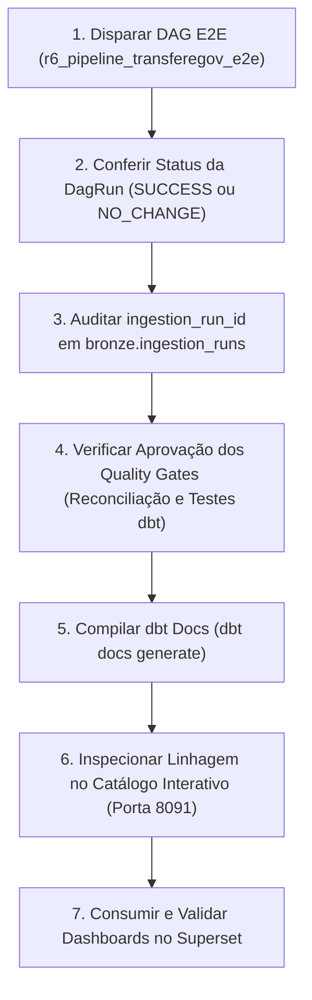

# Guia de Operação e Reprodutibilidade

## 1. Visão Geral

Este guia descreve os procedimentos operacionais para reproduzir integralmente o ambiente do **Lakehouse de Transferências Discricionárias e Legais da União**, desde a inicialização da stack Docker até a orquestração do pipeline de ponta a ponta, auditoria de dados e geração do catálogo técnico dbt Docs.

---

## 2. Pré-requisitos do Ambiente

Para executar e auditar o Lakehouse localmente, certifique-se de que a estação de trabalho atende aos seguintes requisitos:

- **Sistema Operacional**: Windows 10/11 com WSL2, Linux (Ubuntu 22.04+) ou macOS.
- **Docker e Docker Compose**: Docker Desktop ou Docker Engine instalado (versão Compose v2.20+ recomendada).
- **Recursos Mínimos Recomendados**:
  - Memória RAM: 16 GB alocados para o Docker Engine.
  - CPU: 4 núcleos virtuais.
  - Armazenamento: Mínimo de 30 GB de espaço livre em disco para imagens, containers e volumes Delta/MinIO.
- **Git**: Versão 2.40+ para controle de versão.
- **Python**: Versão 3.10 ou superior (para execução de scripts de validação e CI leve local).

---

## 3. Inicialização e Monitoramento da Stack

### 3.1 Subir os Serviços
No diretório raiz do repositório, execute:

```bash
docker compose up -d
```

### 3.2 Validar a Saúde dos Containers
Verifique o estado de execução dos serviços essenciais:

```bash
docker compose ps
```

Todos os serviços a seguir devem apresentar status `Up` ou `Up (healthy)`:
- `minio`: Object storage S3 compatível.
- `mc`: Utilitário de inicialização dos buckets `bronze`, `silver` e `gold` no MinIO.
- `airflow-db`: Banco de dados relacional PostgreSQL do Airflow.
- `airflow`: Agendador, executor e webserver do Apache Airflow.
- `spark-master`: Nó mestre do cluster Apache Spark 3.4.
- `spark-worker-1` / `spark-worker-2`: Nós de processamento distribuído.
- `spark-thrift-server`: Servidor Hive Thrift para consultas analíticas SQL.
- `superset`: Servidor de Business Intelligence do Apache Superset.

---

## 4. Endpoints Locais do Ambiente

Os serviços do Lakehouse expõem as seguintes interfaces Web no ambiente local (portas mapeadas no host):

| Serviço | URL de Acesso Local | Finalidade Operacional |
| :--- | :--- | :--- |
| **Apache Airflow** | `http://localhost:8080` | Interface de orquestração, monitoramento de DAGs e inspeção de logs. |
| **MinIO Console** | `http://localhost:9001` | Interface gráfica dos buckets `bronze`, `silver` e `gold`; os ZIPs RAW ficam sob `bronze/raw/transferegov/`. |
| **Spark Master UI** | `http://localhost:8081` | Monitoramento de jobs Spark, estágios de computação e uso de memória. |
| **Apache Superset** | `http://localhost:8088` | Visualização de painéis e dashboards executivos de transferências da União. |
| **dbt Docs** | `http://localhost:8091` | Servidor interativo do catálogo de dados, descrições e grafo de linhagem. |
| **Spark Thrift Server** | `localhost:10000` | Endpoint JDBC/ODBC para consultas SQL diretas via Hive Metastore. |

> [!IMPORTANT]
> As credenciais de acesso padrão configuradas no arquivo `docker-compose.yml` e variáveis de ambiente destinam-se exclusivamente ao desenvolvimento e teste local. Elas **não devem ser utilizadas em ambientes de produção** e precisam ser externalizadas em cofre corporativo de segredos em qualquer implantação produtiva.

---

## 5. Ciclo Operacional Recomendado de Governança

Para garantir a integridade dos dados e a validação contínua da governança, recomenda-se a seguinte ordem de execução:



### 5.1 Execução do Pipeline E2E via Airflow
Acesse `http://localhost:8080` ou execute via linha de comando no container do Airflow:

```bash
docker exec airflow airflow dags trigger r6_pipeline_transferegov_e2e
```

- Se a fonte governamental estiver inalterada desde a última carga, o pipeline encerrará rapidamente com status `NO_CHANGE`.
- Para forçar uma ingestão integral (reprocessamento de validação), forneça a configuração `force_bronze`:

```bash
docker exec airflow airflow dags trigger -c '{"force_bronze": true}' r6_pipeline_transferegov_e2e
```

### 5.2 Execução Apenas de Transformações (Camadas Downstream)
Se a camada Bronze já estiver carregada e você desejar reprocessar apenas as camadas Silver, Gold e Serving:

```bash
docker exec airflow airflow dags trigger r6_transformacoes_lakehouse
```

Esse é o caminho governado para reprocessamento downstream porque mantém os quality gates e a sequência definida na DAG. Uma execução direta de comandos dbt pode ser útil para desenvolvimento/diagnóstico, mas **não é equivalente ao pipeline governado** e não substitui as reconciliações do Airflow.

---

## 6. Catálogo Interativo dbt Docs

Para compilar e servir o catálogo técnico e o grafo de linhagem E2E:

### 6.1 Geração dos Metadados do Catálogo
Execute a compilação do manifesto e catálogo sem uso de cache parcial:

```bash
docker exec airflow bash -lc "cd /home/airflow/dbt_lakehouse && dbt docs generate --no-partial-parse --profiles-dir ."
```

Esse comando analisa os arquivos YAML e o Hive Metastore, produzindo em `target/`:
- `manifest.json`: Árvore completa de dependências, modelos, testes e documentação.
- `catalog.json`: Metadados físicos de tabelas, tipos de dados e partições.
- `index.html`: Interface visual SPA do dbt Docs.

### 6.2 Inicialização do Servidor de Documentação
Inicie o servidor HTTP na porta exposta `8091`:

```bash
docker exec -d airflow bash -lc "cd /home/airflow/dbt_lakehouse && dbt docs serve --host 0.0.0.0 --port 8091 --profiles-dir ."
```

Acesse em seu navegador:
`http://localhost:8091`

---

## 7. Procedimentos de Parada e Salvaguardas com Volumes

### 7.1 Parada Normal da Stack
Para interromper a execução dos containers preservando todo o histórico de dados e metadados:

```bash
docker compose down
```

> [!CAUTION]
> **NUNCA execute `docker compose down -v`** em ambiente de homologação ou durante auditorias. O modificador `-v` exclui permanentemente todos os volumes de dados locais do Docker, provocando a perda irreversível dos buckets MinIO, do catálogo Hive/Thrift e da base relacional do Airflow.

---

## 8. Perspectivas e Trabalhos Futuros

Como evolução futura da arquitetura de governança, identificam-se as seguintes oportunidades técnicas (não implementadas no escopo atual):
- Integração com catálogos de metadados corporativos (ex.: **DataHub** ou **Apache Atlas**) através de push de eventos em tempo real a partir do Airflow.
- Implementação de políticas de mascaramento dinâmico de dados pessoais (Data Masking) no Thrift Server.
- Automação de rotinas de manutenção `VACUUM` nas tabelas Delta Lake para controle de expansão de armazenamento.
