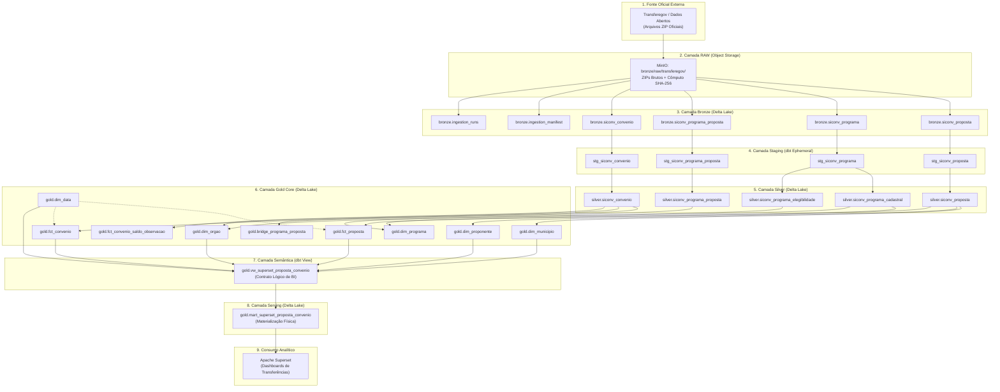
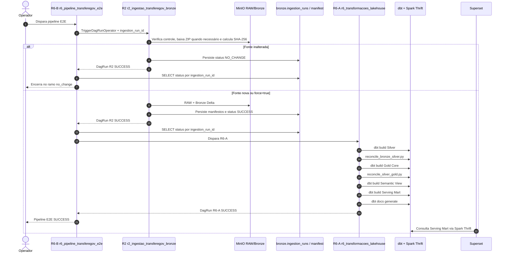

# Matriz de Qualidade e Linhagem E2E

## 1. Visão Geral

A governança do Lakehouse implementa controles ativos e testes automatizados distribuídos por todas as fases do ciclo de processamento. Este documento consolida a **Matriz Multidimensional de Qualidade de Dados** e descreve formalmente as duas visões de linhagem do sistema: a **Linhagem Lógica de Dados** e a **Linhagem Operacional de Orquestração**.

---

## 2. Matriz Multidimensional de Qualidade

Cada dimensão de qualidade possui controles explícitos, regras de aplicação, mecanismos executores e comportamento estrito de fail-fast em caso de inconformidade:

| Dimensão de Qualidade | Controle Específico | Camada de Atuação | Mecanismo Executor | Comportamento em Caso de Falha |
| :--- | :--- | :--- | :--- | :--- |
| **Integridade da Fonte** | Hash SHA-256 por arquivo e validação estrutural do ZIP/CSV | RAW / Bronze | `spark/ingest_transferegov.py` e módulos de ingestão | A falha impede a publicação válida da tabela Delta/catálogo; o objeto RAW pode permanecer como evidência física conforme o ponto da falha. |
| **Freshness (Recência)** | Detecção de atualização da fonte via `data_carga_siconv` | Ingestão / RAW | R2 + DAG controladora `r6_pipeline_transferegov_e2e` | Se inalterado: persiste `NO_CHANGE` e encerra sem reconstruir downstream. Se novo/forçado: executa o ciclo completo. |
| **Completude** | Restrição de valores nulos em chaves primárias e atributos essenciais | Silver / Gold / Serving | Teste `not_null` nativo do dbt (`schema.yml`) | Falha no `dbt build` da etapa correspondente e bloqueio das tarefas downstream. |
| **Unicidade** | Unicidade estrita de chaves primárias e superchaves de negócio | Silver / Gold / Serving | Teste `unique` do dbt e testes SQL customizados (`tests/*.sql`) | Falha do `dbt build` e bloqueio do pipeline analítico downstream. |
| **Validade** | Aderência de domínios cadastrais (siglas de UF, flags SIM/NÃO, sentinelas de data) | Silver / Gold | Teste `accepted_values` do dbt | Falha do build dbt em caso de valores fora do domínio regulamentado. |
| **Integridade Referencial**| Existência de chaves estrangeiras entre fatos e dimensões | Gold Core | Teste `relationships` do dbt | Falha do build dbt; impede que fatos fiquem órfãos de dimensões essenciais. |
| **Reconciliação Bronze-Silver**| Conferência de contagem de linhas e preservação de entidades | Silver | Script `reconcile_bronze_silver.py` executado via Spark | Interrupção do pipeline; valida se DISTINCT e castings mantiveram a paridade matemática esperada. |
| **Reconciliação Silver-Gold**| Conferência de reconciliação de grãos e chaves canônicas | Gold Core | Script `reconcile_silver_gold.py` executado via Spark | Interrupção do pipeline; assegura que a modelagem dimensional não gerou perda ou duplicação. |
| **Equivalência Serving** | Paridade matemática de métricas entre View Semântica e Serving Mart | Semantic / Serving | Testes automatizados de validação analítica do ciclo R5 | Interrupção da promoção para o Superset caso haja divergência de centavos ou contagens. |
| **Rastreabilidade** | Proveniência por linha + linhagem de modelo/execução | Bronze / Silver / Gold observacional / downstream analítico | Metadados técnicos, `ingestion_runs`, `ingestion_manifest`, dbt `ref()` e DagRuns | Row-level lineage é preservado em Bronze/Silver e `fct_convenio_saldo_observacao`; Gold canônica, Semantic e Serving usam linhagem de modelo/execução, sem promessa de rastreio por linha ao arquivo fonte. |
| **Qualidade Operacional** | Tolerância a falhas, isolamento de tarefas e idempotência | Orquestração (Airflow) | Airflow fail-fast, branching e quality gates | Falha bloqueia tarefas downstream; não há rollback transacional automático das camadas já materializadas. |
| **Consistência Financeira** | Proibição de caminhos aditivos N:N e isolamento de saldo observacional | Gold / Semantic / Serving | Modelagem dimensional estrita e testes dbt | Mitiga o risco de dupla contagem de recursos públicos em relatórios institucionais. |

---

## 3. Linhagem Lógica de Dados (Data Lineage)

A linhagem lógica ilustra o fluxo de transformação, modelagem e enriquecimento dos dados desde a disponibilização pública até os dashboards executivos:

### Trilha de Linhagem Lógica Textual
1. **Transferegov**: Pacote ZIP oficial com dados abertos governamentais.
2. **MinIO RAW**: Armazenamento imutável e cômputo do hash SHA-256.
3. **Bronze Delta**: Carga fiel de todos os campos como string e anexação de metadados técnicos.
4. **Staging dbt (ephemeral)**: Normalização, casting de datas brasileiras e valores decimais.
5. **Silver Delta**: Desacoplamento cadastral, separação de elegibilidade e identificação de conflitos.
6. **Gold Delta**: Modelagem dimensional em estrela (fatos, dimensões e pontes).
7. **Semantic View**: View dbt consolidando o grão proposta com LEFT JOIN em convênio e regras semânticas.
8. **Serving Mart**: Tabela Delta física materializada para performance de alta velocidade.
9. **Superset**: Camada final de visualização analítica para tomada de decisão.

---

## 4. Linhagem Operacional e Trilha de Auditoria (Airflow E2E)

A linhagem operacional documenta como os identificadores técnicos de execução e hash criptográfico atravessam todo o orquestrador Apache Airflow para garantir auditabilidade contínua:

### Trilha de Auditoria Técnica Operacional
A rastreabilidade de ponta a ponta é mantida pela correlação estrita entre:
- **R6-B DagRun**: Instância de orquestração mestre.
- **R2 DagRun**: Instância filha responsável pela extração física.
- **`ingestion_run_id`**: Identificador determinístico e seguro de correlação, persistido em `bronze.ingestion_runs`.
- **`bronze.ingestion_manifest`**: Metadados de cada arquivo individual (linhas lidas, linhas gravadas, versão Delta).
- **`__source_sha256`**: Assinatura criptográfica preservada nas linhas Bronze/Silver e na fato observacional de saldo; para Gold canônica, Semantic e Serving a ligação à carga ocorre por lineage de modelo/execução.
- **R6-A DagRun**: Execução sequencial de modelos dbt, testes e reconciliações relacionais.
- **Serving Delta**: Versão final materializada no MinIO, consumida pelo Apache Superset com garantia de proveniência comprovável.
