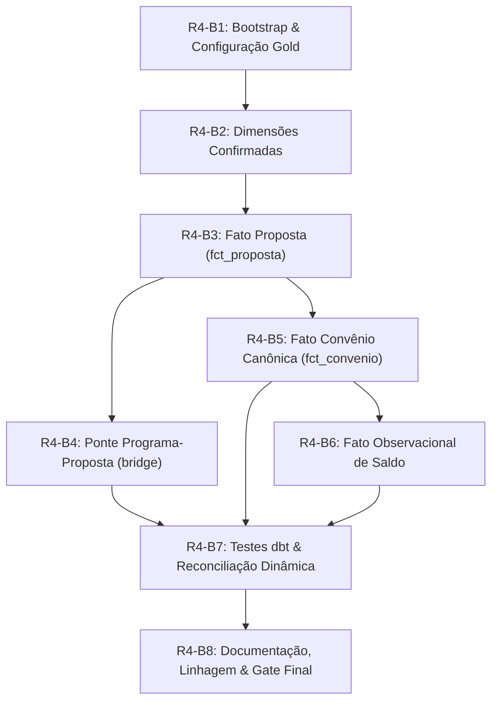

# R4-A — Plano de Execução da Etapa R4-B (Construção da Camada Gold)

Este documento estabelece o roteiro técnico detalhado, a ordem de precedência de engenharia, os requisitos de bootstrap e os testes de reconciliação para a futura etapa **R4-B (Implementação da Camada Gold)**, fundamentado estritamente nas evidências empíricas e contratos aprovados no **R4-A** e refinados no **R4-A.1**.

---

## 1. Diretrizes Estratégicas para o R4-B

1. **Separação Rígida entre Análise (R4-A/R4-A.1) e Materialização (R4-B)**: Nenhuma tabela Gold foi criada no R4-A nem no R4-A.1. O R4-B será responsável pela primeira escrita em `s3a://gold/warehouse`.
2. **Reconciliação Operacional Dinâmica**: Todos os testes automatizados de integridade do pipeline Gold devem comparar a **Silver corrente com a Gold corrente**, sem depender de números fixos de linhas ou valores hardcoded como critério de sucesso operacional.
3. **Preservação de Valores Decimais e Tolerância Zero**: Toda métrica financeira na Gold deverá reconciliar exatamente (tolerância R$ 0,00, tipo DECIMAL) com as consultas canônicas na Silver.
4. **Consolidação de Convênios sem Heurísticas Ocultas**: A criação de `fct_convenio` utilizará deduplicação de atributos comprovadamente estáveis (`SELECT DISTINCT`), rejeitando `ROW_NUMBER()` ou escolhas arbitrárias de registros.
5. **Isolamento de Observações Bancárias**: A divergência de `valor_saldo_conta` será acomodada na entidade própria `fct_convenio_saldo_observacao`.
6. **Estratégia de Chaves Naturais**: Adoção direta de natural keys (`identificacao_proponente`, `codigo_municipio_ibge`, `codigo_orgao`, `id_programa`) nas dimensões cadastrais do R4 inicial, evitando sobrecarga de surrogate keys artificiais sem necessidade comprovada de SCD2.

---

## 2. Sequência Ordenada de Implementação (Subetapas R4-B1 a R4-B8)



---

### R4-B1 — Bootstrap do Catálogo e Configuração da Camada Gold
- **Ações**:
  - Criar `scripts/bootstrap_gold.py` (idempotente e seguro, espelhando o padrão já validado do `bootstrap_silver.py`).
  - Registrar no Hive Metastore / Spark Thrift Server o schema `gold` com `LOCATION 's3a://gold/warehouse'`.
  - Configurar no dbt (`dbt_lakehouse/dbt_project.yml`) os caminhos para a camada Gold (`models/gold/dimensions`, `models/gold/facts`, `models/gold/bridges`).
- **Verificação**:
  - `SHOW DATABASES` contendo `gold`.
  - `DESCRIBE DATABASE EXTENDED gold` apontando para `s3a://gold/warehouse`.

---

### R4-B2 — Materialização das Dimensões Confirmadas
As dimensões devem ser criadas antes das fatos para garantir que chaves naturais e de data estejam disponíveis para integridade referencial:
1. **`gold.dim_data`**:
   - Geração de série diária de calendário civil com grão de 1 dia.
   - **Ratificação da Janela Analítica**: A janela candidata `1990-01-01` a `2050-12-31` será formalmente ratificada com a revisão humana no início do R4-B.
   - Inserção dos registros sentinela obrigatórios:
     - `-1`: `Data Não Informada / NULL`
     - `-2`: `Data Fora da Janela Analítica` (< 1990 ou > 2050)
   - Formato Delta em `s3a://gold/warehouse/dim_data`.
2. **`gold.dim_municipio`**:
   - Carga a partir de `silver.siconv_proposta` via `SELECT DISTINCT codigo_municipio_ibge, municipio_proponente, uf_proponente`.
   - Grão: 1 linha por `codigo_municipio_ibge` (chave natural de 7 dígitos).
3. **`gold.dim_orgao`**:
   - Consolidação dos papéis superior e concedente via união de códigos de `silver.siconv_proposta` e `silver.siconv_programa_cadastral`.
   - Grão: 1 linha por `codigo_orgao` (chave natural).
   - Atributos: `codigo_orgao`, `descricao_orgao`, `is_orgao_superior`, `is_orgao_concedente`.
4. **`gold.dim_proponente`**:
   - Carga a partir de `silver.siconv_proposta` via `SELECT DISTINCT` sobre `identificacao_proponente` e atributos cadastrais.
   - Grão: 1 linha por `identificacao_proponente` (chave natural CNPJ/CPF).
5. **`gold.dim_programa`**:
   - Carga a partir de `silver.siconv_programa_cadastral` via `SELECT DISTINCT`.
   - Grão: 1 linha por `id_programa` (chave natural).

---

### R4-B3 — Materialização da Fato Proposta (`fct_proposta`)
- **Ações**:
  - Materializar `gold.fct_proposta` a partir de `silver.siconv_proposta`.
  - Enriquecimento com chaves relacionais (`data_proposta_sk`, `identificacao_proponente`, `codigo_municipio_ibge`, `codigo_orgao_superior`, `codigo_orgao`).
  - Preservação estrita das medidas monetárias como `DECIMAL(17,2)`.
- **Relação com Convênio**: Respeitar a semântica de $1 : 0..1$ (nem toda proposta possui convênio formalizado).

---

### R4-B4 — Materialização da Ponte Programa-Proposta (`bridge_programa_proposta`)
- **Ações**:
  - Materializar `gold.bridge_programa_proposta` a partir de `silver.siconv_programa_proposta`.
  - Grão: 1 linha por par `(id_programa, id_proposta)`.
  - **Proibido carregar medidas financeiras** ou fatores de rateio proporcional nesta entidade.

---

### R4-B5 — Materialização da Fato Convênio Canônica (`fct_convenio`)
- **Ações**:
  - Materializar `gold.fct_convenio` consolidando as observações estáveis por `numero_convenio`.
  - Deduplicação limpa via `SELECT DISTINCT` sobre os atributos de negócio comprovadamente estáveis.
  - **Exclusão expressa** da coluna `valor_saldo_conta`.
- **Grão**: 1 linha por `numero_convenio`.

---

### R4-B6 — Materialização da Fato Observacional de Saldo (`fct_convenio_saldo_observacao`)
- **Ações**:
  - Materializar `gold.fct_convenio_saldo_observacao` a partir de `silver.siconv_convenio`.
  - Grão: 1 linha por observação física (`id_convenio_observacao`).
  - Campos: `id_convenio_observacao`, `numero_convenio`, `valor_saldo_conta`, `has_source_conflict`, metadados.

---

### R4-B7 — Suíte de Testes dbt e Reconciliação Operacional Dinâmica

A validação operacional do R4-B baseia-se **exclusivamente em testes dinâmicos** entre a Silver corrente e a Gold corrente:

#### 1. Reconciliação Dinâmica de Proposta:
```sql
-- assert_reconcile_gold_proposta_dynamic.sql
WITH silver_agg AS (
    SELECT
        COUNT(*) as cnt,
        SUM(valor_global_proposta) as val_global,
        SUM(valor_repasse_proposta) as val_repasse,
        SUM(valor_contrapartida_proposta) as val_contrapartida
    FROM {{ source('silver', 'siconv_proposta') }}
),
gold_agg AS (
    SELECT
        COUNT(*) as cnt,
        SUM(valor_global_proposta) as val_global,
        SUM(valor_repasse_proposta) as val_repasse,
        SUM(valor_contrapartida_proposta) as val_contrapartida
    FROM {{ ref('fct_proposta') }}
)
SELECT *
FROM silver_agg s
JOIN gold_agg g ON 1=1
WHERE s.cnt != g.cnt
   OR s.val_global != g.val_global
   OR s.val_repasse != g.val_repasse
   OR s.val_contrapartida != g.val_contrapartida
```

#### 2. Reconciliação Dinâmica de Convênio (via Consulta Canônica):
```sql
-- assert_reconcile_gold_convenio_dynamic.sql
WITH canonical AS (
    SELECT DISTINCT
        numero_convenio,
        valor_global_convenio,
        valor_repasse_convenio,
        valor_contrapartida_convenio,
        valor_empenhado_convenio,
        valor_desembolsado_convenio,
        valor_saldo_remanescente_tesouro,
        valor_saldo_remanescente_convenente,
        valor_rendimento_aplicacao,
        valor_ingresso_contrapartida,
        valor_global_original_convenio
    FROM {{ source('silver', 'siconv_convenio') }}
),
canonical_agg AS (
    SELECT
        COUNT(*) as cnt,
        SUM(valor_global_convenio) as val_global,
        SUM(valor_repasse_convenio) as val_repasse,
        SUM(valor_contrapartida_convenio) as val_contrapartida,
        SUM(valor_empenhado_convenio) as val_empenhado,
        SUM(valor_desembolsado_convenio) as val_desembolsado
    FROM canonical
),
gold_agg AS (
    SELECT
        COUNT(*) as cnt,
        SUM(valor_global_convenio) as val_global,
        SUM(valor_repasse_convenio) as val_repasse,
        SUM(valor_contrapartida_convenio) as val_contrapartida,
        SUM(valor_empenhado_convenio) as val_empenhado,
        SUM(valor_desembolsado_convenio) as val_desembolsado
    FROM {{ ref('fct_convenio') }}
)
SELECT *
FROM canonical_agg c
JOIN gold_agg g ON 1=1
WHERE c.cnt != g.cnt
   OR c.val_global != g.val_global
   OR c.val_repasse != g.val_repasse
   OR c.val_contrapartida != g.val_contrapartida
   OR c.val_empenhado != g.val_empenhado
   OR c.val_desembolsado != g.val_desembolsado
```

#### 3. Reconciliação Dinâmica de Dimensões:
- `COUNT(dim_proponente) = COUNT(DISTINCT silver.siconv_proposta.identificacao_proponente)`
- `COUNT(dim_municipio) = COUNT(DISTINCT silver.siconv_proposta.codigo_municipio_ibge)`
- `COUNT(dim_programa) = COUNT(DISTINCT silver.siconv_programa_cadastral.id_programa)`
- `COUNT(dim_orgao) = COUNT(DISTINCT união dos 3 papéis)`

#### 4. Baseline Histórico Opcional R4-A (Auditoria e Regressão de Snapshot):
Os números apurados no R4-A (ex: 1.157.619 propostas, R$ 1,495 tri, 287.584 convênios canônicos, R$ 356,84 bi) serão mantidos em script de auditoria opcional (`python spark/profile_r4a.py --check-baseline-r4a`), sem travar a execução do pipeline produtivo em caso de novas cargas da fonte.

---

### R4-B8 — Documentação, Linhagem e Validação Final
- Documentar modelos e colunas em `dbt_lakehouse/models/gold/schema.yml`.
- Gerar documentação dbt (`dbt docs generate`).
- Validar ausência de regressão nas camadas Bronze e Silver.

---

## 3. Critérios de Aceitação para o Início do R4-B

A execução do marco R4-B está condicionada aos seguintes gates prévios:
1. Revisão e aprovação formal do marco **R4-A.1** pelo usuário / revisor humano.
2. Nenhuma tabela Gold materializada antes da autorização expressa.
3. Testes unitários do repositório mantidos em 100% de aprovação.
4. Ratificação formal da janela analítica de calendário (`dim_data`).

---

## 4. R4-A.1 — Fechamento dos Findings da Revisão Humana

- **Reconciliação Dinâmica**: Removidos todos os testes com números fixos como critério obrigatório de CI/pipeline; adotadas fórmulas SQL de reconciliação dinâmica contra a Silver corrente e contra a consulta canônica de convênios.
- **Baseline Histórico R4-A Desacoplado**: Os valores do snapshot de 16/09/2026 foram transferidos para a categoria de baseline de auditoria histórica.
- **Estratégia de Chaves Naturais**: Formalizada a ausência de surrogate keys artificiais nas dimensões cadastrais, preservando as chaves de negócio da fonte.
- **Ratificação de Janela de Data**: Definido que a janela 1990–2050 será ratificada formalmente na subetapa R4-B1/R4-B2.
