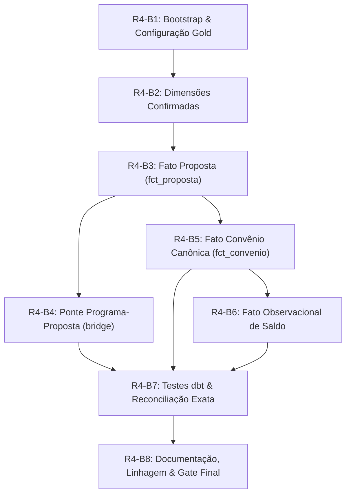

# R4-A — Plano de Execução da Etapa R4-B (Construção da Camada Gold)

Este documento estabelece o roteiro técnico detalhado, a ordem de precedência de engenharia, os requisitos de bootstrap e os testes de reconciliação para a futura etapa **R4-B (Implementação da Camada Gold)**, fundamentado estritamente nas evidências empíricas e contratos aprovados no **R4-A**.

---

## 1. Diretrizes Estratégicas para o R4-B

1. **Separação Rígida entre Análise (R4-A) e Materialização (R4-B)**: Nenhuma tabela Gold foi criada no R4-A. O R4-B será responsável pela primeira escrita em `s3a://gold/warehouse`.
2. **Preservação de Valores Decimais e Reconciliação Rigorosa**: Toda métrica financeira na Gold deverá reconciliar exatamente (até o centavo, tolerância R$ 0,00) com os totais canônicos auditados no R4-A.
3. **Consolidação de Convênios sem Heurísticas Ocultas**: A criação de `fct_convenio` utilizará deduplicação de atributos estáveis (`SELECT DISTINCT`), rejeitando `ROW_NUMBER()` ou escolhas arbitrárias de registros.
4. **Isolamento de Observações Bancárias**: A divergência de `valor_saldo_conta` será acomodada na entidade própria `fct_convenio_saldo_observacao`.

---

## 2. Sequência Ordenada de Implementação (Subetapas R4-B1 a R4-B8)

---

### R4-B1 — Bootstrap do Catálogo e Configuração da Camada Gold
- **Ações**:
  - Criar `scripts/bootstrap_gold.py` (idempotente e seguro, espelhando o padrão já validado do `bootstrap_silver.py`).
  - Registrar no Hive Metastore / Spark Thrift Server o schema `gold` com `LOCATION 's3a://gold/warehouse'`.
  - Configurar no dbt (`dbt_lakehouse/dbt_project.yml`) os caminhos para a camada Gold (`models/gold/dimensions`, `models/gold/facts`, `models/gold/bridges`).
- **Verificação**:
  - `SHOW DATABASES` contendo `gold`.
  - `DESCRIBE DATABASE EXTENDED gold` apontando para `s3a://gold/warehouse`.

---

### R4-B2 — Materialização das Dimensões Confirmadas
As dimensões devem ser criadas antes das fatos para garantir que chaves substitutas (SKs) e foreign keys estejam disponíveis:
1. **`gold.dim_data`**:
   - Geração de série diária de `1990-01-01` a `2050-12-31`.
   - Inserção dos registros sentinela obrigatórios: `-1` (Data Não Informada / NULL) e `-2` (Data Fora do Domínio Válido).
   - Formato Delta em `s3a://gold/warehouse/dim_data`.
2. **`gold.dim_municipio`**:
   - Carga a partir de `silver.siconv_proposta` (5.570 linhas exatas).
   - Colunas: `codigo_municipio_ibge`, `nome_municipio`, `sigla_uf`.
3. **`gold.dim_orgao`**:
   - Consolidação dos papéis superior e concedente a partir de `silver.siconv_proposta` e `silver.siconv_programa_cadastral` (184 linhas exatas).
   - Colunas: `codigo_orgao`, `descricao_orgao`, `is_orgao_superior`, `is_orgao_concedente`.
4. **`gold.dim_proponente`**:
   - Carga a partir de `silver.siconv_proposta` (29.325 linhas exatas).
   - Grão: 1 linha por `identificacao_proponente`.
5. **`gold.dim_programa`**:
   - Carga a partir de `silver.siconv_programa_cadastral` (53.018 linhas exatas).
   - Grão: 1 linha por `id_programa`.

---

### R4-B3 — Materialização da Fato Proposta (`fct_proposta`)
- **Ações**:
  - Materializar `gold.fct_proposta` a partir de `silver.siconv_proposta`.
  - Enriquecimento com chaves relacionais (`data_proposta_sk`, `identificacao_proponente`, `codigo_municipio_ibge`, `codigo_orgao_superior`, `codigo_orgao`).
  - Preservação estrita das medidas monetárias como `DECIMAL(17,2)`.
- **Validação de Grão**: Exatamente 1.157.619 linhas.

---

### R4-B4 — Materialização da Ponte Programa-Proposta (`bridge_programa_proposta`)
- **Ações**:
  - Materializar `gold.bridge_programa_proposta` a partir de `silver.siconv_programa_proposta`.
  - Grão: 1 linha por par `(id_programa, id_proposta)` (1.158.975 linhas).
  - Sem medidas financeiras.

---

### R4-B5 — Materialização da Fato Convênio Canônica (`fct_convenio`)
- **Ações**:
  - Materializar `gold.fct_convenio` consolidando as observações estáveis por `numero_convenio`.
  - Deduplicação limpa via `SELECT DISTINCT` sobre os atributos de negócio comprovadamente estáveis.
  - **Exclusão** de `valor_saldo_conta`.
- **Validação de Grão**: Exatamente 287.584 linhas.

---

### R4-B6 — Materialização da Fato Observacional de Saldo (`fct_convenio_saldo_observacao`)
- **Ações**:
  - Materializar `gold.fct_convenio_saldo_observacao` a partir de `silver.siconv_convenio`.
  - Grão: 1 linha por observação física (`id_convenio_observacao`) com 287.586 linhas.
  - Campos: `id_convenio_observacao`, `numero_convenio`, `valor_saldo_conta`, `has_source_conflict`, metadados.

---

### R4-B7 — Suíte de Testes dbt e Reconciliação Matemática Automatizada
- **Testes Estruturais dbt**:
  - `unique` e `not_null` em todas as PKs.
  - `relationships` (FKs para dimensões e entre fatos).
- **Testes de Reconciliação Exata (SQL Custom Tests)**:
  1. `assert_reconcile_gold_proposta_financials.sql`:
     - $\sum fct\_proposta.valor\_global = \text{R\$ } 1.495.209.875.334,42$
     - $\sum fct\_proposta.valor\_repasse = \text{R\$ } 1.425.758.135.735,63$
     - $\sum fct\_proposta.valor\_contrapartida = \text{R\$ } 69.451.779.598,79$
  2. `assert_reconcile_gold_convenio_financials.sql`:
     - $\sum fct\_convenio.valor\_global = \text{R\$ } 356.840.744.533,16$
     - $\sum fct\_convenio.valor\_repasse = \text{R\$ } 331.271.766.468,34$
     - $\sum fct\_convenio.valor\_contrapartida = \text{R\$ } 23.709.764.114,58$
     - $\sum fct\_convenio.valor\_empenhado = \text{R\$ } 192.064.543.060,79$
     - $\sum fct\_convenio.valor\_desembolsado = \text{R\$ } 153.205.012.397,29$
  3. `assert_no_financial_inflation_in_bridge.sql`:
     - Verifica que a ponte de programas não contém medidas numéricas monetárias.

---

### R4-B8 — Documentação, Linhagem e Validação Final
- Documentar modelos e colunas em `dbt_lakehouse/models/gold/schema.yml`.
- Gerar documentação dbt (`dbt docs generate`).
- Validar ausência de regressão no Airflow e nos dados das camadas Bronze e Silver.

---

## 3. Critérios de Aceitação para o Início do R4-B

A execução do marco R4-B está condicionada aos seguintes gates prévios:
1. Revisão e aprovação formal do marco R4-A pelo usuário / revisor humano.
2. Nenhuma tabela Gold materializada antes da autorização expressa.
3. Testes unitários do repositório mantidos em 100% de aprovação.
