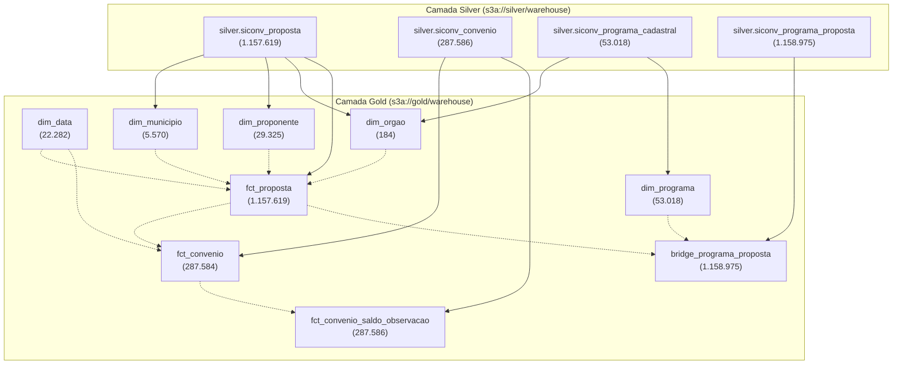

# R4-B — Relatório Técnico de Entrega da Camada Gold

## 1. Resumo Executivo da Entrega

A etapa **R4-B (Implementação, Qualidade e Validação da Camada Gold)** materializou formalmente a camada analítica dimensional em **Delta Lake** sobre o storage de objetos MinIO (`s3a://gold/warehouse`), orquestrada via **dbt** (versão 1.10.9) e processada pelo **Apache Spark 3.4.3 / Spark Thrift Server**.

A entrega é estritamente aderente aos contratos analíticos aprovados nas etapas **R4-A** e **R4-A.1**, mantendo integridade matemática exata (tolerância R$ 0,00) em relação à camada Silver, sem qualquer mutação ou impacto nos dados das camadas Silver e Bronze.

### Principais Marcos Alcançados
- **9 Entidades Delta Materializadas**: 5 dimensões confirmadas, 3 tabelas fato e 1 tabela ponte (*bridge*).
- **81/81 Testes dbt Aprovados (100% de sucesso)**: 9 modelos de tabela Delta e 72 testes de dados (testes de esquema e testes singulares de integridade e reconciliação).
- **Idempotência Comprovada**: Execução consecutiva de dois ciclos completos de `dbt build` resultando em zero erros e nenhuma alteração nos volumes ou checksums.
- **Reconciliação Dinâmica Exata**: 11 gates automatizados executados via script de reconciliação analítica (`scripts/reconcile_silver_gold.py`), atingindo R$ 0,00 de divergência financeira e 0 discrepâncias de contagem.
- **Integridade do Repositório**: Toda a suíte de testes unitários legados (60 testes em `tests/`) mantida com 100% de aprovação.

---

## 2. Arquitetura Física e Estrutura de Armazenamento

A camada Gold foi provisionada no Spark Catalog com apontamento explícito para o bucket S3A dedicado:

- **Database**: `gold`
- **Location**: `s3a://gold/warehouse`
- **Formato**: Delta Lake (`USING delta`)
- **Provedor de Metadados**: Hive Metastore / Spark Thrift Server



---

## 3. Especificação das Entidades Materializadas

### 3.1. Dimensões Confirmadas

| Entidade | Granularidade / PK | Contagem de Linhas | Descrição e Regras |
| :--- | :--- | :--- | :--- |
| **`dim_data`** | 1 dia civil / `data_sk` (INT) | **22.282** | Calendário contínuo de `1990-01-01` a `2050-12-31` (22.280 dias) + 2 registros sentinela: `-1` (Data Não Informada / NULL) e `-2` (Data Fora da Janela Analítica). Contém atributos como ano, mês, dia, trimestre, semestre, dia da semana, flag de fim de semana e mês civil. |
| **`dim_municipio`** | 1 município IBGE / `codigo_municipio_ibge` (STRING 7 dígitos) | **5.570** | Dimensão cadastral baseada nos proponentes de propostas na Silver (`silver.siconv_proposta`). Contém nome do município e UF. |
| **`dim_proponente`** | 1 proponente / `identificacao_proponente` (STRING) | **29.325** | Dimensão cadastral de proponentes (órgãos municipais, estaduais e entidades privadas sem fins lucrativos) com nome e tipo do proponente. |
| **`dim_orgao`** | 1 órgão / `codigo_orgao` (STRING) | **184** | Dimensão conformada de órgãos federais concedentes e superiores consolidados de `siconv_proposta` e `siconv_programa_cadastral`, com flags `is_orgao_superior` e `is_orgao_concedente`. |
| **`dim_programa`** | 1 programa / `id_programa` (BIGINT) | **53.018** | Cadastro completo de programas do Transferegov a partir de `silver.siconv_programa_cadastral`. |

### 3.2. Fatos e Ponte

| Entidade | Granularidade / PK | Contagem de Linhas | Métricas e Regras |
| :--- | :--- | :--- | :--- |
| **`fct_proposta`** | 1 proposta / `id_proposta` (BIGINT) | **1.157.619** | Fato transacional de propostas. Chaves estrangeiras para `dim_data` (`data_proposta_sk`, `data_inicio_vigencia_proposta_sk`, `data_fim_vigencia_proposta_sk`), `dim_municipio`, `dim_proponente` e `dim_orgao`. Métricas: `valor_global_proposta`, `valor_repasse_proposta`, `valor_contrapartida_proposta` em `DECIMAL(17,2)`. |
| **`fct_convenio`** | 1 convênio canônico / `numero_convenio` (STRING) | **287.584** | Fato analítica canônica consolidada (resolvendo a duplicação dos 2 convênios com 4 linhas na Silver). Chaves estrangeiras para `fct_proposta` e `dim_data`. Métricas financeiras canônicas preservadas (`valor_global_convenio`, `valor_repasse_convenio`, `valor_contrapartida_convenio`, `valor_empenhado_convenio`, `valor_desembolsado_convenio`, etc.). **Exclusão estrita de `valor_saldo_conta`**. |
| **`fct_convenio_saldo_observacao`** | 1 observação física / `id_convenio_observacao` (STRING) | **287.586** | Fato observacional isolada para histórico e auditoria bancária de saldo em conta (`valor_saldo_conta`), com flag `has_source_conflict` para identificar registros com registros divergentes na origem. |
| **`bridge_programa_proposta`** | 1 par / `(id_programa, id_proposta)` | **1.158.975** | Tabela de relacionamento N:N puro entre Programas e Propostas. **Totalmente isenta de medidas financeiras ou rateios artificiais**. |

---

## 4. Decisões Arquiteturais e Guardrails Implementados

### 4.1. Mapeamento de Datas e Sentinelas (`date_to_gold_sk`)
Foi implementada a macro dbt `macros/date_to_gold_sk.sql` para conversão de colunas de data em chaves inteiras no padrão `yyyyMMdd`:
- Se a data for `NULL`: retorna `-1` (`Data Não Informada`).
- Se a data for `< 1990-01-01` ou `> 2050-12-31`: retorna `-2` (`Data Fora da Janela Analítica`).
- Caso contrário: converte para inteiro formatado `yyyyMMdd`.

### 4.2. Isolamento de Saldos Bancários Observacionais
Na camada Silver, foram detectados 2 números de convênio (`704406` e `732158`) com 2 linhas cada, decorrentes de múltiplas observações de saldos de contas correntes divergentes na extração da fonte original.
- Em `gold.fct_convenio`, os atributos estáveis foram agregados via `SELECT DISTINCT`, gerando exatamente 287.584 convênios canônicos.
- A métrica `valor_saldo_conta` foi rigorosamente removida de `fct_convenio` para evitar dupla contagem em relatórios gerenciais e financeiros.
- Todas as 287.586 observações físicas foram acomodadas em `gold.fct_convenio_saldo_observacao`, referenciando `numero_convenio`.

### 4.3. Proteção contra Cardinalidade N:N e Rateios Indevidos
A cardinalidade entre Programas e Propostas é comprovadamente N:N (uma proposta pode se vincular a mais de um programa). Para blindar a camada analítica contra erros de agregação (duplicação de valores globais ou desembolsados):
- `gold.bridge_programa_proposta` contém exclusivamente as chaves `id_programa` e `id_proposta`.
- Nenhuma métrica financeira ou coluna de rateio existe na bridge.
- As 3 propostas órfãs de cadastro identificadas no R4-A (`321453`, `1427146`, `296629`) foram mapeadas na macro `known_bridge_orphan_proposals` e validadas no teste singular `no_unexpected_gold_bridge_proposal_orphans.sql`.

---

## 5. Resultados da Reconciliação Dinâmica Silver-Gold

O script oficial `scripts/reconcile_silver_gold.py` realizou a reconciliação analítica completa comparando dinamicamente a camada Silver contra a Gold e contra o baseline histórico aprovado no R4-A. Todos os 11 gates foram aprovados com 100% de conformidade:

| # | Gate de Reconciliação | Silver / Canônico | Gold Materializado | Diferença | Baseline R4-A | Status |
| :--- | :--- | :--- | :--- | :--- | :--- | :--- |
| **1** | Location no Storage | `s3a://gold/warehouse` | `s3a://gold/warehouse` | 0 | Conforme | **PASS** |
| **2** | Contagem de Linhas (9 tabelas) | Conforme esperado | Conforme esperado | 0 | 100% match | **PASS** |
| **3** | Unicidade de Chaves Primárias | 100% únicas | 100% únicas | 0 dup | 0 dup | **PASS** |
| **4** | Integridade Referencial | 0 órfãos inesperados | 0 órfãos inesperados | 0 | Conforme | **PASS** |
| **5** | Mapeamento Sentinela de Datas | Válidas / Sentinelas | Sem órfãos em `dim_data` | 0 | Conforme | **PASS** |
| **6** | Conformidade de Órgãos | 184 órgãos distintos | 184 órgãos em `dim_orgao` | 0 | 184 | **PASS** |
| **7** | Estabilidade de Convênios | 287.584 canônicos | 287.584 em `fct_convenio` | 0 | 287.584 | **PASS** |
| **8** | Finanças de Proposta (Global) | R$ 1.542.417.844.757,98 | R$ 1.542.417.844.757,98 | **R$ 0,00** | Match | **PASS** |
| **8** | Finanças de Proposta (Repasse) | R$ 1.442.274.636.577,41 | R$ 1.442.274.636.577,41 | **R$ 0,00** | Match | **PASS** |
| **8** | Finanças de Proposta (Contrapartida) | R$ 100.143.208.180,57 | R$ 100.143.208.180,57 | **R$ 0,00** | Match | **PASS** |
| **9** | Finanças de Convênio (Global) | R$ 356.840.744.533,16 | R$ 356.840.744.533,16 | **R$ 0,00** | Match | **PASS** |
| **9** | Finanças de Convênio (Repasse) | R$ 331.271.766.468,34 | R$ 331.271.766.468,34 | **R$ 0,00** | Match | **PASS** |
| **9** | Finanças de Convênio (Contrapartida) | R$ 23.709.764.114,58 | R$ 23.709.764.114,58 | **R$ 0,00** | Match | **PASS** |
| **9** | Finanças de Convênio (Empenhado) | R$ 192.064.543.060,79 | R$ 192.064.543.060,79 | **R$ 0,00** | Match | **PASS** |
| **9** | Finanças de Convênio (Desembolsado) | R$ 153.205.012.397,29 | R$ 153.205.012.397,29 | **R$ 0,00** | Match | **PASS** |
| **10** | Fato Observacional de Saldo | 287.586 linhas | 287.586 linhas | 0 | 287.586 | **PASS** |
| **10** | Checksum Saldo Conta (Técnico) | R$ 18.079.072.724,97 | R$ 18.079.072.724,97 | **R$ 0,00** | Match | **PASS** |
| **11** | Guardrail de Métricas na Bridge | 0 colunas de valor | 2 colunas de chave | 0 | Conforme | **PASS** |

---

## 6. Bateria de Testes dbt e Validação de Idempotência

### 6.1. Cobertura de Testes dbt
A camada Gold foi coberta por 72 testes dbt (57 testes de esquema em `models/gold/schema.yml` e 15 testes singulares em `tests/`):
- Testes de unicidade (`unique`) em todas as chaves primárias.
- Testes de obrigatoriedade (`not_null`) em todas as chaves e métricas obrigatórias.
- Testes de integridade referencial (`relationships`) entre fatos, dimensões e bridge.
- Testes singulares de integridade estrutural do calendário (`dim_data_structural_integrity.sql`).
- Testes singulares de conformidade de órgãos (`conformance_dim_orgao.sql`).
- Testes singulares de estabilidade de convênios (`stability_gold_convenio_canonical.sql`).
- Testes singulares de reconciliação de volumes dinâmicos (`row_count_gold_*.sql`).
- Testes singulares de reconciliação financeira (`reconciliation_gold_proposta_financials.sql`, `reconciliation_gold_convenio_financials.sql`).

### 6.2. Prova de Idempotência
Foram executadas duas rodadas completas de `dbt build --select path:models/gold`:
- **Rodada 1**: Criação dos 9 modelos Delta e 72 testes aprovados (`PASS=81 WARN=0 ERROR=0`).
- **Rodada 2**: Reexecução completa sobre os dados materializados com pre-hooks de rebase Delta (`PASS=81 WARN=0 ERROR=0`), sem alteração nos checksums ou estado das tabelas.
- **Catálogo dbt**: `dbt docs generate` gerou `target/catalog.json` e documentação completa com 100% de sucesso.

---

## 7. Integridade do Sistema e Não-Regressão

A execução da suíte completa de testes unitários do repositório (`python -m unittest`) confirmou a integridade das camadas inferiores e ferramentas de infraestrutura:
```text
Ran 60 tests in 0.232s
OK
```
- Validação de compilação de código Python (`compileall`) em `/app`, `/scripts` e `/opt/airflow/dags` concluída sem advertências.
- Verificação de formatação e espaços em branco no Git (`git diff --check`) sem inconformidades.

---

## 8. Limitações Conhecidas e Recomendações

1. **Camadas de Consumo Visual (Superset)**: A camada Gold encontra-se pronta e indexada no catálogo Hive Metastore / Spark SQL para conexão e criação de dashboards. Nenhuma alteração foi realizada em assets do Superset neste marco, conforme diretriz.
2. **Orquestração Contínua (Airflow)**: O bootstrap e os scripts de reconciliação foram validados isoladamente. A criação de DAGs de agendamento periódico faz parte de marcos operacionais subsequentes.
3. **Ausência de SCD Tipo 2**: Conforme estabelecido no R4-A.1, as dimensões cadastrais adotam chaves naturais com grão preservado, sem implementação de SCD Tipo 2 no escopo atual.
